# Sistema CRM para restaurantes com Django + MongoDB + Atendente IA

Este é um projeto de **Sistema CRM** completo desenvolvido em **Django** com integração ao **MongoDB**, **OPEN AI**, **WAHA**.  
O objetivo é permitir que restaurantes, lanchonetes ou similares possam gerenciar sua operação de forma simples e prática,  
mesmo sem acesso ao admin do Django, já que a integração com o MongoDB impede o uso direto da interface administrativa padrão.
O CRM ainda conta com um atendente IA para o whatsapp que faz o atendimento dos clientes, anota os pedidos e faz cobranças no pix e cartão.

---

## 📌 Funcionalidades
- Adicionar novos itens ao cardápio.
- Adicionar novos adicionais (extras).
- Upload de imagens para os produtos.
- Visualizar detalhes de cada produto.
- Organização dos itens por categorias.
- Dashboard gerencial:
 - Controle da operação do restaurante
- Controle dos pedidos:
 - Exibe pedidos realizado pelo Agent no whatsapp salvos no MongoDB
 - Alteração de status (Pedidos em preparo, pedidos prontos, pedidos que saíram para entrega, retirada ou balcão, pedidos concluídos)
 - Criação manual de pedidos
- Integração com WhatsApp via Agent de IA:
 - Anotar pedidos diretamente no WhatsApp.
 - Calcular automaticamente o valor da entrega a partir do endereço ou localização enviada pelo cliente.
 - Gerar links de pagamento de forma automática.
 - Notificar a confirmação do pagamento.
 - Suporte para pedidos alternativos (ex.: retirada no balcão, reservas, etc.).

---

## 🛠 Tecnologias Utilizadas
- **Python 3.x**
- **Django**
- **MongoDB** (com `djongo` ou `pymongo`, conforme configuração)
- **Bootstrap** (para o layout responsivo)
- **HTML5 / CSS3 / JavaScript**
- **WAHA API**
- **LANGGRAPH**
- **Google MAPS API**
- **OPENAI API**
- **ASAAS BANK API**
- **FLASK**

---

## 📂 Estrutura de Mídia
O sistema utiliza o diretório **media/** para armazenar as imagens dos produtos.  
Por padrão:
```
media/
└── produtos/
    ├── produto1.jpg
    ├── produto2.jpg
```
Certifique-se de configurar corretamente no `settings.py`:
```python
MEDIA_URL = '/media/'
MEDIA_ROOT = BASE_DIR / 'media'
```

E no `urls.py` principal:
```python
from django.conf import settings
from django.conf.urls.static import static

urlpatterns = [
    # suas rotas
] + static(settings.MEDIA_URL, document_root=settings.MEDIA_ROOT)
```

---

## 🚀 Como Executar o Projeto

1. **Clonar o repositório**
```bash
git clone https://github.com/Vipires19/menu_online.git
cd menu_online
```

2. **Criar e ativar um ambiente virtual**
```bash
python -m venv venv
source venv/bin/activate  # Linux/Mac
venv\Scripts\activate   # Windows
```

3. **Instalar as dependências**
```bash
pip install -r requirements.txt
```

4. **Configurar o banco de dados MongoDB**  
   - Ajuste as credenciais no `settings.py`.

5. **Rodar as migrações**
```bash
python manage.py migrate
```

6. **Iniciar o servidor**
```bash
python manage.py runserver
```

7. **Acessar no navegador**
```
http://127.0.0.1:8000/
```

---
## 📱 Integração com WhatsApp

1. **Clone o repositório**
   ```bash
   git clone https://github.com/Vipires19/menu_online.git
   cd menu_online

2. **Crie e ative um ambiente virtual**
  ```bash
  python -m venv venv
  source venv/bin/activate  # Linux/Mac
  venv\Scripts\activate     # Windows
  ```

3. **Instale as dependências**
  ``` bash
  pip install -r requirements.txt
  ```

4. **Configure as variáveis de ambiente (.env)**
  ``` bash
  OPENAI_API_KEY= "SUA KEY DA OPENAI"
  MONGO_USER = "SEU USUÁRIO MONGODB"
  MONGO_PASS = "SUA SENHA MONGODB"
  ASSAS_ACCESS_TOKEN = "SUA KEY DO ASSAS"
  NGROK_AUTHTOKEN= "EM AMBIENTE DE DESENVOLVIMENTO UTILIZEI O NGROK PARA GERAR UM DOMÍNIO HTTPS PARA O WEBHOOK DO ASSAS ENTÃO É NECESSÁRIO O AUTHTOKEN DO NGROK"
  ```

5. **Execute o agente**

 Eu utilizo dois terminais:
  - Um com o comando:
     ``` bash
     docker-compose up --build waha
     ```
  - Outo com o comando:
     ``` bash
     docker-compose up --build api
     ```

Em minha humilde opinião torna mais fácil o DEBUG
---

## 📷 Exemplo de Tela
Tela inicial
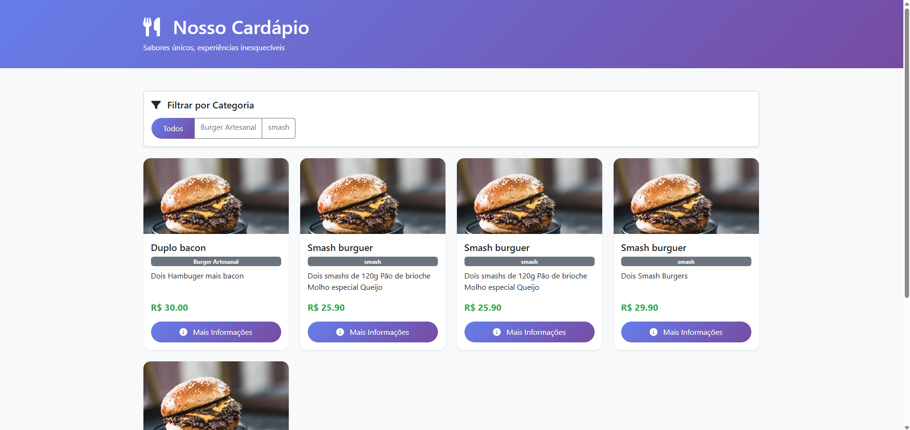

Detalhes do produto
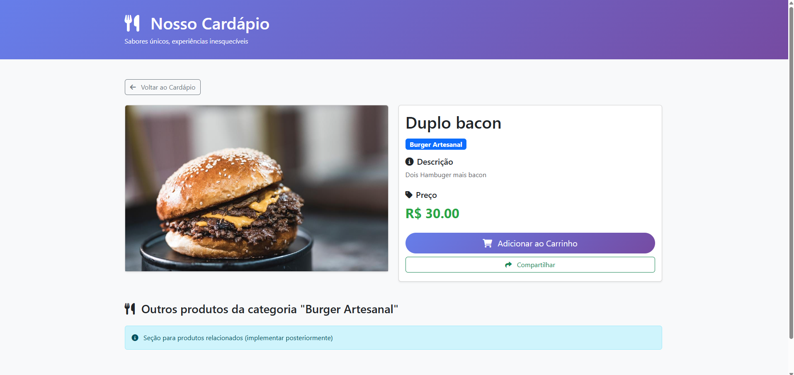

Adicionar novos produtos
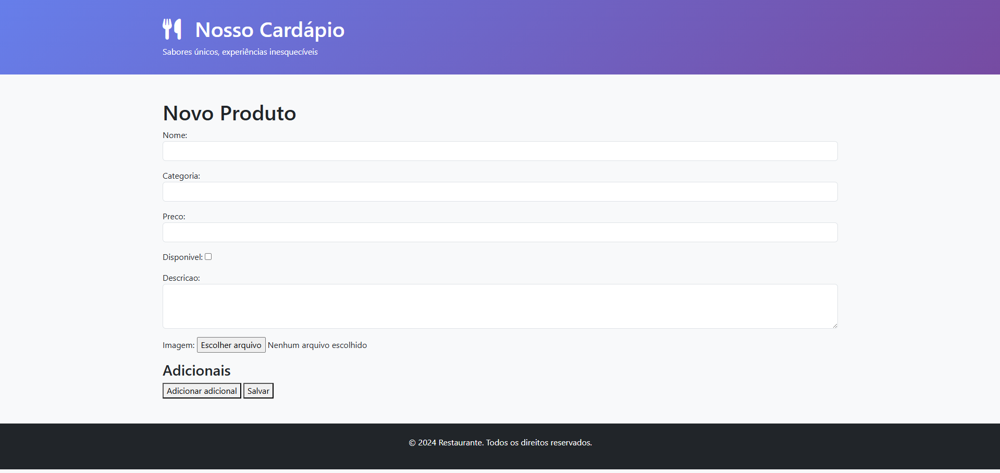

Dashboard operacional
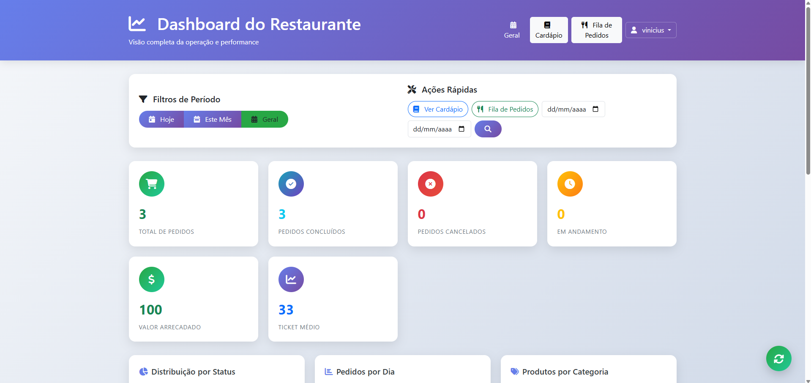
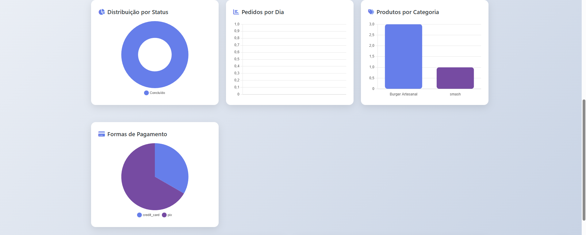
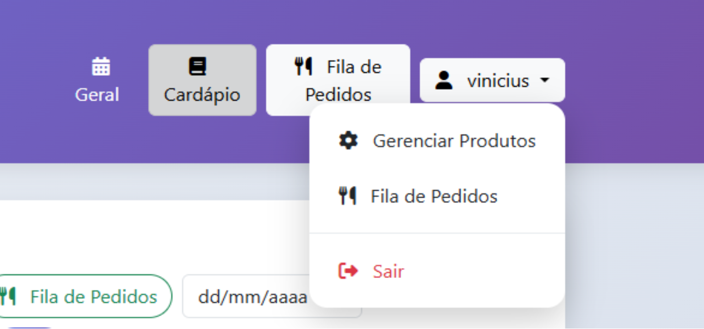

Fila de pedidos - Controle de status e produção
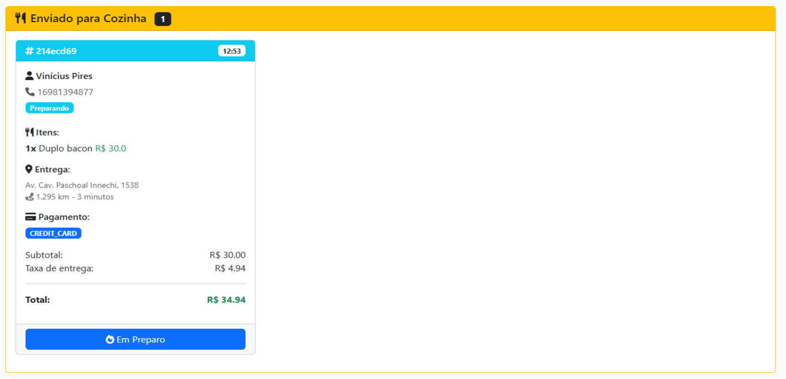
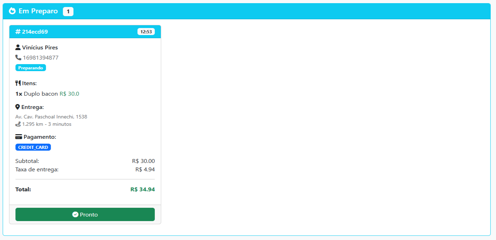
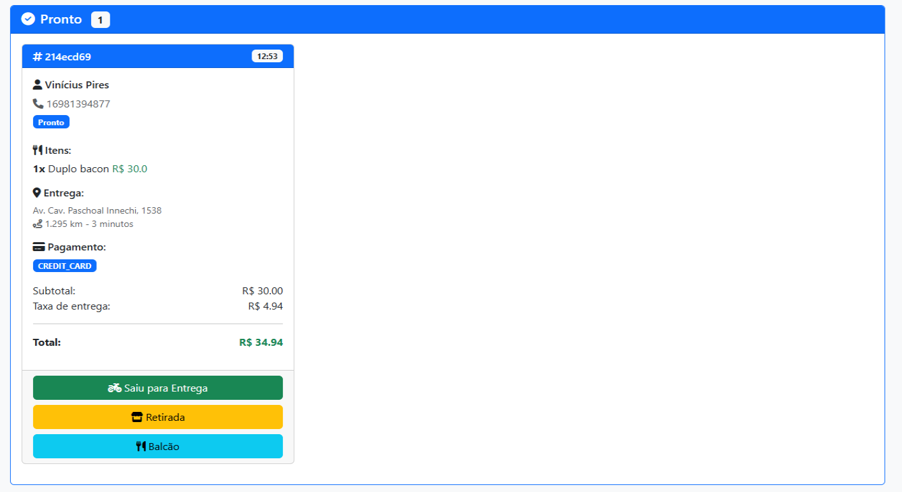
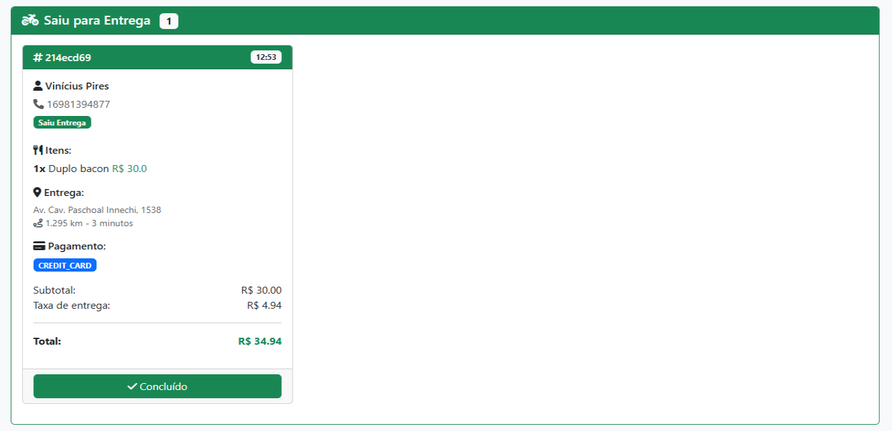

Fluxo de atendimento no whatsapp
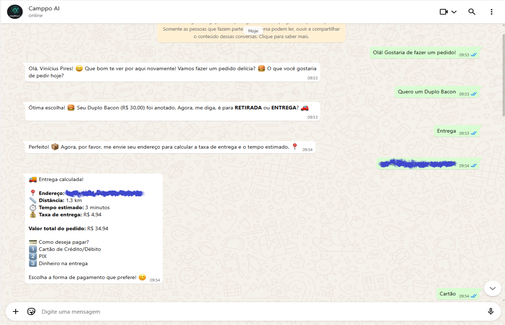
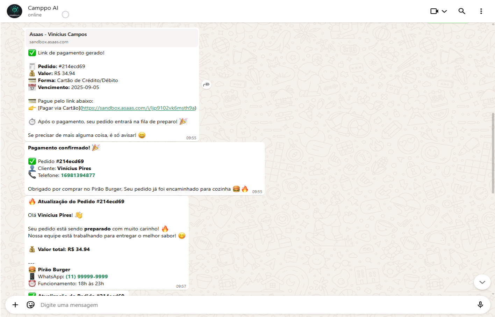
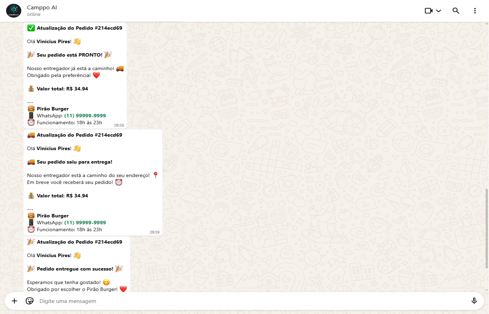

---

## 📄 Licença
MIT License - sinta-se livre para usar, adaptar e contribuir!
